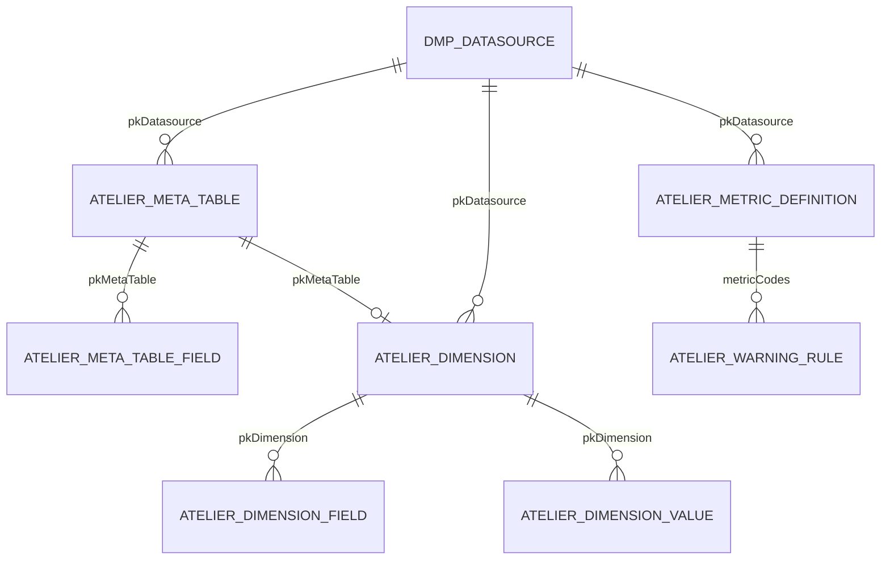

# new-atelier — 数据工场重构版

面向 **降低使用门槛** 与 **降低耦合性** 的渐进式重写，路径：`/Volumes/S/IdeaProjects/yonyou/new-atelier`。

## 与 dmp-atelier 的核心差异

| 维度 | dmp-atelier（旧） | new-atelier（新） |
|------|------------------|-------------------|
| 指标标识 | UUID / indexPk | **code**（如 `revenue`） |
| 存储内容 | 预生成 SQL + relation 混用语义 | **声明式定义**，查询时编译 |
| 过滤条件 | 保存时写入 WHERE | **查询时传入** `filters` |
| 模块 | 单模块 God Class 3300 行 | **9 模块** 分层 |
| 基础设施 | bd-platform 8.52-SNAPSHOT | **atelier-infra** 自研 |
| API 版本 | `/api/v1/*` | **`/api/v2/*`** |

## 模块结构（五大管理域）

```
new-atelier/
├── atelier-domain/          # 领域模型（指标、元数据、维度、预警）
├── atelier-infra/           # JPA 实体/仓储、数据源、JDBC 执行
├── atelier-metadata/        # 元数据管理（表/字段 CRUD、JDBC 发现）
├── atelier-dimension/       # 维度管理（LIST/TREE/TIME_DIM）
├── atelier-metrics/         # 指标编译器（MetricQueryCompiler）
├── atelier-warning/         # 预警规则 + QLExpress 表达式桩
├── atelier-query/           # 查询编排（编译 + 执行 SPI）
├── atelier-api/             # REST 控制器（5 大管理域）
└── atelier-app/             # Spring Boot 启动 + schema.sql / data.sql
```

## 实体关系图



**链路：** 数据源 → 元数据表/字段 → 维度定义/值 → 指标定义 → 预警规则

## API 清单（/api/v2/）

### 1. 数据源管理

| 方法 | 路径 | 说明 |
|------|------|------|
| GET | `/api/v2/datasources` | 列表 |
| GET | `/api/v2/datasources/{id}` | 详情 |
| POST | `/api/v2/datasources` | 新增/更新（自动 refresh 连接池） |
| DELETE | `/api/v2/datasources/{id}` | 删除 |
| POST | `/api/v2/datasources/test` | 测试连接 |

### 2. 元数据管理

| 方法 | 路径 | 说明 |
|------|------|------|
| GET | `/api/v2/metadata/tables` | 表列表（可选 `datasourceId`） |
| GET | `/api/v2/metadata/tables/{id}` | 表详情含字段 |
| POST | `/api/v2/metadata/tables` | 新增/更新表 |
| DELETE | `/api/v2/metadata/tables/{id}` | 删除表及字段 |
| GET | `/api/v2/metadata/tables/{id}/fields` | 字段列表 |
| POST | `/api/v2/metadata/tables/{id}/fields` | 新增/更新字段 |
| DELETE | `/api/v2/metadata/fields/{fieldId}` | 删除字段 |
| POST | `/api/v2/metadata/discover?datasourceId=` | JDBC 表发现（桩） |

### 3. 维度管理

| 方法 | 路径 | 说明 |
|------|------|------|
| GET | `/api/v2/dimensions` | 维度列表 |
| GET | `/api/v2/dimensions/{id}` | 维度详情 |
| POST | `/api/v2/dimensions` | 新增/更新 |
| DELETE | `/api/v2/dimensions/{id}` | 删除 |
| GET | `/api/v2/dimensions/{id}/values` | 维度数据 |
| POST | `/api/v2/dimensions/{id}/values` | 保存维度值 |
| DELETE | `/api/v2/dimensions/values/{valueId}` | 删除维度值 |

### 4. 指标管理

| 方法 | 路径 | 说明 |
|------|------|------|
| GET | `/api/v2/metrics/definitions` | 指标定义列表 |
| GET | `/api/v2/metrics/definitions/{code}` | 指标定义详情 |
| POST | `/api/v2/metrics/definitions` | 新增/更新 |
| DELETE | `/api/v2/metrics/definitions/{code}` | 删除 |
| POST | `/api/v2/metrics/query` | 查询指标数据 |
| GET | `/api/v2/metrics/{code}/sql` | 预览编译 SQL |

### 5. 预警规则管理

| 方法 | 路径 | 说明 |
|------|------|------|
| GET | `/api/v2/warning/rules` | 规则列表 |
| GET | `/api/v2/warning/rules/{id}` | 规则详情 |
| POST | `/api/v2/warning/rules` | 新增/更新 |
| DELETE | `/api/v2/warning/rules/{id}` | 删除 |
| POST | `/api/v2/warning/rules/evaluate` | 表达式评估桩 |

所有接口返回统一包装 `ApiResponse<T>`：`{ "code": 0, "message": "success", "data": ... }`

## 旧版 dmp-atelier 表映射

| 管理域 | 旧表名 | 新表名 | 最小字段集 |
|--------|--------|--------|-----------|
| 数据源 | `DMP_DATASOURCE` | `DMP_DATASOURCE`（兼容） | PK_DATASOURCE, DS_NAME, CONNECT_URL, DS_USERNAME, VERIFICATION, DB_TYPE, ENABLE |
| 元数据 | bd-common MetaTableVO | `ATELIER_META_TABLE` | PK, TABLE_CODE, TABLE_NAME, PK_DATASOURCE |
| 元数据字段 | MetaTableFieldVO | `ATELIER_META_TABLE_FIELD` | PK, PK_META_TABLE, FIELD_CODE, FIELD_NAME, FIELD_TYPE |
| 维度 | `DMP_STD_K_DIM` | `ATELIER_DIMENSION` | PK, DS_CODE, DS_NAME, DS_TYPE, PK_DATASOURCE, PK_META_TABLE |
| 维度字段 | `DMP_STD_K_DIM_FIELD` | `ATELIER_DIMENSION_FIELD` | PK, PK_DIMENSION, FIELD_CODE, CODE_FIELD, NAME_FIELD |
| 指标 | `DMP_ATELIER_N_INDEX` + 子表 | `ATELIER_METRIC_DEFINITION` | METRIC_CODE, DEFINITION_JSON（整份声明式定义） |
| 预警 | `DMP_ATELIER_WARNING_RULE` | `ATELIER_WARNING_RULE` | RULE_CODE, METRIC_CODES, EXPRESSION, ENABLED, WARNING_LEVEL |

## 旧版 API 映射

| 域 | 旧路径 | 新路径 |
|----|--------|--------|
| 数据源 | bd-platform IDataSourceService | `/api/v2/datasources` |
| 元数据 | `/api/v1/meta/*` | `/api/v2/metadata/*` |
| 维度 | `/api/v1/dataSet/*` | `/api/v2/dimensions` |
| 指标 | `/api/v1/dataIndex/*` | `/api/v2/metrics/*` |
| 预警 | `/api/v1/warningRule/*` | `/api/v2/warning/rules` |

## 快速体验

```bash
cd /Volumes/S/IdeaProjects/yonyou/new-atelier
mvn clean install

cd atelier-app && mvn spring-boot:run

# 数据源
curl http://localhost:8090/api/v2/datasources

# 元数据
curl http://localhost:8090/api/v2/metadata/tables

# 维度
curl http://localhost:8090/api/v2/dimensions

# 指标定义
curl http://localhost:8090/api/v2/metrics/definitions

# 指标查询
curl -X POST http://localhost:8090/api/v2/metrics/query \
  -H 'Content-Type: application/json' \
  -d '{"metricCodes":["revenue"],"filters":[{"field":"dept_code","operator":"IN","values":["001"]}]}'

# 预警规则
curl http://localhost:8090/api/v2/warning/rules
```

## 从 dmp-atelier 迁移路径

1. **数据源**：直接迁移 `DMP_DATASOURCE` 表数据（列名兼容）
2. **元数据**：从 bd-common MetaTableVO 导出，写入 `ATELIER_META_TABLE` / `ATELIER_META_TABLE_FIELD`
3. **维度**：`DMP_STD_K_DIM` → `ATELIER_DIMENSION`，字段映射 → `ATELIER_DIMENSION_FIELD`
4. **指标**：`DMP_ATELIER_N_INDEX` 多表 → 转换脚本生成 `DEFINITION_JSON`（声明式）
5. **预警**：`DMP_ATELIER_WARNING_RULE` → `ATELIER_WARNING_RULE`，INDEX_PK 改为 metric code

## 实现状态

| 能力 | 状态 |
|------|------|
| 数据源 CRUD + 连接测试 + Registry 热加载 | ✅ 完整 |
| 元数据表/字段 CRUD | ✅ 完整 |
| JDBC 表发现 | ⚡ 简化桩 |
| 维度 CRUD + 演示数据 | ✅ 完整 |
| 维度树权限/Excel 导入 | ⏸ 未实现 |
| 指标 JPA 持久化 + CRUD | ✅ 完整 |
| 指标查询编译执行 | ✅ 完整（已有） |
| MetricModel JPA | ⏸ 仍用内存 |
| 预警规则 CRUD | ✅ 完整 |
| QLExpress 表达式评估 | ⚡ 桩实现 |
| 预警任务调度/批次/结果 | ⏸ 未实现 |
| 目录树管理 | ⏸ 扁平 catalogCode |

## 设计原则

1. **定义与执行分离** — 保存结构，查询时编译
2. **SPI 隔离** — 模块间通过接口解耦
3. **自研 infra** — 零 bd-common/bd-platform 依赖
4. **API 面向业务 code** — 用户无需理解 UUID

## 技术栈

- Java 8 / Spring Boot 2.7.12
- Maven 多模块
- H2 + JPA（演示）
- HikariCP + commons-dbutils
- QLExpress 3.3.2（预警表达式桩）

## 测试

```bash
mvn clean install   # 含 5 域各 1 个集成测试（atelier-app）
mvn test -pl atelier-infra
mvn test -pl atelier-metrics
```
