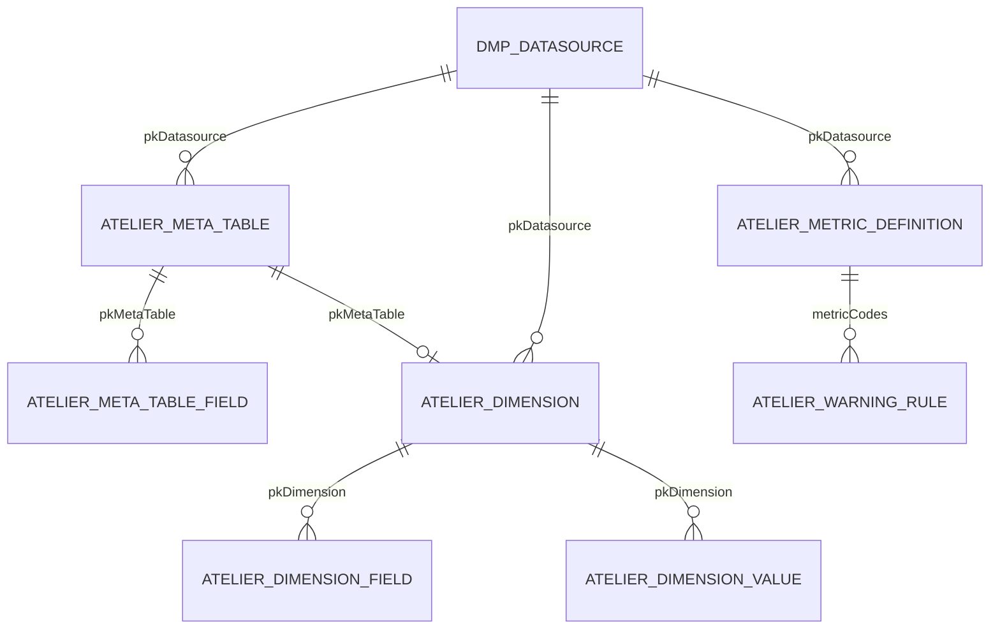

# new-atelier — 数据工场重构版

面向 **降低使用门槛** 与 **降低耦合性** 的渐进式重写，路径：`/Volumes/S/IdeaProjects/yonyou/new-atelier`。

---

## 快速启动

### 环境要求

| 工具 | 版本 |
|------|------|
| JDK | 8 |
| Maven | 3.6+ |
| Node.js | 18+（前端） |

### 一键启动（推荐）

项目根目录提供开发脚本，单终端完成编译、启动与日志跟踪：

```bash
cd /Volumes/S/IdeaProjects/yonyou/new-atelier

# 启动（编译后端 + 构建前端 + 启动前后端 + 跟踪日志）
scripts/start-dev.sh

# 另开终端停止，或在启动终端按 Ctrl+C
scripts/stop-dev.sh
```

| 脚本 | 说明 |
|------|------|
| [`scripts/start-dev.sh`](scripts/start-dev.sh) | `mvn clean install -DskipTests` → `npm install && npm run build` → 启动后端（8090）与前端（5173），日志输出到 `logs/` |
| [`scripts/stop-dev.sh`](scripts/stop-dev.sh) | 优雅停止占用 8090 / 5173 的进程（先 SIGTERM，超时后 SIGKILL） |
| [`scripts/dev-common.sh`](scripts/dev-common.sh) | 上述脚本的公共函数（进程树终止、端口释放），一般无需直接调用 |
| [`scripts/smoke-test.sh`](scripts/smoke-test.sh) | 后端启动后的 API 冒烟测试（可选） |

**日志文件：**

| 文件 | 内容 |
|------|------|
| `logs/backend.log` | Spring Boot / Maven 输出 |
| `logs/frontend.log` | Vite dev server 输出 |

**环境变量（可选）：**

本机 JDK / Maven 路径与默认不一致时，复制示例配置并按需修改：

```bash
cp scripts/.env.example scripts/.env
# 编辑 JAVA_HOME、MAVEN_HOME、MAVEN_OPTS 等
```

`start-dev.sh` 启动时会自动 `source` 以下文件（按优先级）：

1. 项目根目录 `.env`
2. `scripts/.env`

可通过环境变量覆盖默认端口：`BACKEND_PORT`（默认 8090）、`FRONTEND_PORT`（默认 5173）。

**停止说明：**

- 在 `start-dev.sh` 终端按 **Ctrl+C**，或另开终端执行 `scripts/stop-dev.sh`
- 被外部停止后，`start-dev.sh` 会自动退出并提示「服务已停止」
- 日志中 Maven 的 `BUILD FAILURE` / `exit code 143` 为 `spring-boot:run` 被正常终止时的表现，可忽略

### 手动启动（双终端）

如需分别调试前后端，可使用以下方式。

### 后端

```bash
cd /Volumes/S/IdeaProjects/yonyou/new-atelier
mvn clean install

cd atelier-app
mvn spring-boot:run
```

- 默认端口：**8090**
- 启动类：`atelier-app/.../NewAtelierApplication.java`
- 配置文件：`atelier-app/src/main/resources/application.yml`

### 前端

```bash
cd atelier-web
npm install
npm run dev
```

- 默认端口：**5173**
- 详见 [`atelier-web/README.md`](atelier-web/README.md)

### 访问地址

| 服务 | URL | 说明 |
|------|-----|------|
| 管理控制台 | http://localhost:5173 | React 前端，默认跳转数据源页 |
| 后端 API | http://localhost:8090/api/v2/ | REST 接口根路径 |
| H2 控制台 | — | 演示库为内存模式，无持久化控制台 |

### H2 演示数据库说明

- 应用元数据（数据源、元数据表、维度、指标、预警）存储在 **H2 内存库** `jdbc:h2:mem:atelier`
- 启动时自动执行 `schema.sql` + `data.sql` 初始化表结构与演示数据
- `application.yml` 中 `atelier.datasources` 预置 `ds-demo` 数据源，与元数据库共用同一 H2 实例
- **重启后数据清空**；生产环境请替换为 MySQL/PostgreSQL 等持久化数据库

### 验证 API

后端启动后（`scripts/start-dev.sh` 或手动 `mvn spring-boot:run`）：

```bash
# 冒烟测试（推荐）
scripts/smoke-test.sh

# 或手动 curl
curl http://localhost:8090/api/v2/datasources
curl http://localhost:8090/api/v2/metrics/definitions

curl -X POST http://localhost:8090/api/v2/metrics/query \
  -H 'Content-Type: application/json' \
  -d '{"metricCodes":["revenue"],"filters":[{"field":"dept_code","operator":"IN","values":["001"]}]}'
```

---

## 后端关键点

### 多模块结构

| 模块 | 职责 |
|------|------|
| `atelier-domain` | 领域模型（指标定义、元数据、维度、预警等 POJO / SPI 接口） |
| `atelier-infra` | 基础设施：JPA 实体与仓储、`DataSourceRegistry`、`JdbcQueryExecutor`、`PageSqlBuilder` |
| `atelier-metadata` | 元数据管理：表/字段 CRUD、JDBC 表发现 |
| `atelier-dimension` | 维度管理：LIST / TREE / TIME_DIM 类型 |
| `atelier-metrics` | 指标编译器 `MetricQueryCompiler`（声明式定义 → SQL） |
| `atelier-warning` | 预警规则 CRUD + QLExpress 表达式评估桩 |
| `atelier-document` | 文档对比 / 预览：多格式抽取、三级 Diff、LLM 解读、流式结构预览 |
| `atelier-query` | 查询编排：编译 + 执行 SPI（`MetricQueryService`） |
| `atelier-api` | REST 控制器，统一前缀 `/api/v2/` |
| `atelier-app` | Spring Boot 启动、`WebCorsConfig`、`schema.sql` / `data.sql` |

```
new-atelier/
├── atelier-domain/          # 领域模型
├── atelier-infra/           # JPA + 数据源 + JDBC 执行
├── atelier-metadata/        # 元数据服务
├── atelier-dimension/       # 维度服务
├── atelier-metrics/         # MetricQueryCompiler
├── atelier-warning/         # 预警服务
├── atelier-document/        # 文档对比 / 预览
├── atelier-query/           # 查询编排
├── atelier-api/             # REST 控制器
└── atelier-app/             # Spring Boot 启动
```

### API 前缀与五大管理域

所有 REST 接口统一前缀 **`/api/v2/`**，按业务域划分：

| 域 | Controller | 路径前缀 |
|----|------------|----------|
| 数据源 | `DataSourceController` | `/api/v2/datasources` |
| 元数据 | `MetadataController` | `/api/v2/metadata` |
| 维度 | `DimensionController` | `/api/v2/dimensions` |
| 指标 | `MetricDefinitionController` + `MetricController` | `/api/v2/metrics` |
| 预警 | `WarningRuleController` | `/api/v2/warning/rules` |
| 文档预览 | `DocumentPreviewController` | `/api/v2/document-preview` |
| 文档对比 | `DocumentCompareController` | `/api/v2/document-compare` |

### 文档预览

上传单文件，异步抽取为**流式结构阅读** IR，前端按**规范皮肤**（`styleMode=canonical`）渲染。**非**原文件 WYSIWYG，也不做分页翻页。

| 项 | 说明 |
|----|------|
| 格式 | 与文档对比相同：txt/md/json/代码、docx/xlsx/pptx、PDF、图片 |
| API | `POST /api/v2/document-preview/jobs`（multipart `file` + 可选 `enableLlmStyle`/`enableLlmRefine`/`llmProfileId`）→ `GET .../jobs/{id}` |
| 形态 | `layoutMode=flow`；PPT/Excel 以 `SECTION` 分区标题分隔 |
| PDF/DOCX/MD + LLM 样式 | 默认开启：按页/分片 **SSE 流式** 调用语义 LLM；协议严格按档案 `protocol`（`custom` 且未填时默认 `anthropic` → `/v1/messages`）；LLM **只返回段落索引标注**；失败则规则启发式；读超时默认 180s |
| PDF/DOCX/MD 保真闭环 | 默认开启：抽取后确定性去重 → LLM 样式 → 对比原文（PDF 另附首页图），输出 `DROP`/`MERGE`/`SET` 修补并最多迭代 10 轮（进度 `refining`） |
| 锚点 | 每块含稳定 `id`（`p{page}-{hash}-{occurrence}`）与 `anchor`（page/textHash/offset），DOM 带 `data-block-id`，供 Diff 定位与页面批注 |
| 限制 | 单文件 ≤ 200MB；LLM 样式最多约 30 页；任务 TTL 约 1 小时 |
| 存储 | 复用对比临时目录模式，**不做永久文档库** |
| 已知不足 | 非原版式；双栏/乱序 PDF 可能降级；扫描件依赖 OCR；闭环是结构级近似而非像素级一致；Word 内嵌 EMF/WMF/SmartArt 可能无法浏览器直显；**原生文件批注写回未做**（对比页支持页面一键批注） |

前端入口：管理台菜单 **文档预览**（`/document-preview`）。

### 文档对比

上传文件 A / B，异步产出**文字 / 段落 / 结构**三级差异，并内嵌 A/B **流式结构预览**（可点 Diff 定位到块）。可选大模型解读。

| 项 | 说明 |
|----|------|
| 格式 | txt/md/json/代码、docx/xlsx/pptx、PDF、图片（png/jpg/gif/webp） |
| API | `POST /api/v2/document-compare/jobs`（multipart `fileA`/`fileB` + `options` JSON）→ `GET .../jobs/{id}` |
| options | `ignoreWhitespace`、`excelKeyColumn`、`enableLlm`（解读）、`enableLlmStyle`/`enableLlmRefine`（对比侧预览，**默认 true**）、`llmProfileId` |
| 预览联动 | 结果含 `previewA`/`previewB`；文字 Diff 基于预览拼接明文；hunk/段落/结构带 `blockIdsA`/`blockIdsB`；进度含 `previewing-a` / `previewing-b` |
| 页面批注 | 一键批注：相对视角渲染（A 相对 B / B 相对 A）；目标可选 A、B、A+B；**不写回文件**。设计说明见 `docs/superpowers/specs/2026-08-14-document-compare-layout-annotations.md` |
| 限制 | 单文件 ≤ 200MB；请求体 ≤ 450MB；PDF/PPT 最多 200 页、Excel 最多 50 sheet；任务 TTL 约 1 小时 |
| 存储 | 临时目录（默认 `java.io.tmpdir/atelier-doc-compare/`），**不做永久文档库** |
| OCR | 图片与疑似扫描 PDF 走已配置的多模态 LLM；未配置时跳过/失败并提示 |
| AI 解读 | 基于结构化 diff 摘要，失败时三级 diff 仍可用；**非合规审计唯一依据** |
| 已知不足 | 复杂版式/双栏 PDF/合并单元格可能误报；OCR 有误差；`moved` 依赖相似度阈值；双端 LLM 预览耗时与结果体积较大；单元格级定位未做；批注仅页面渲染 |
| 安全 | 当前实例无登录隔离，任务对实例内可见；上线前需鉴权与租户隔离 |

前端入口：管理台菜单 **文档对比**（`/document-compare`）：对比成功后为三列布局 **预览 A | 预览 B | 差异**；点击差异行在预览中滚动高亮；可一键批注。

## 前端管理控制台（atelier-web）

自包含 React 管理 UI，位于 `atelier-web/`（与 `atelier-app` 平级）。

```bash
# 终端 1 — 后端
cd atelier-app && mvn spring-boot:run

# 终端 2 — 前端
cd atelier-web
npm install
npm run dev
```

- 前端：http://localhost:5173
- 后端：http://localhost:8090
- Vite 代理 `/api` → `8090`，详见 `atelier-web/README.md`


统一响应包装 `ApiResponse<T>`：`{ "code": 0, "message": "success", "data": ... }`

### 指标架构：声明式定义 + 查询时编译

| 概念 | 说明 |
|------|------|
| 标识 | 使用业务 **code**（如 `revenue`），非 UUID |
| 存储 | `ATELIER_METRIC_DEFINITION.DEFINITION_JSON` 保存整份声明式定义 |
| 编译 | `MetricQueryCompiler` 在查询时将定义编译为 SQL |
| 过滤 | **查询时传入** `filters`，不写入持久化定义 |
| 预览 | `GET /api/v2/metrics/{code}/sql` 返回编译后 SQL 与列名 |

### atelier-infra：自研基础设施

替代旧版 `bd-platform`（8.52-SNAPSHOT），零 `bd-common` 依赖：

| 组件 | 作用 |
|------|------|
| `DataSourceRegistry` | 数据源连接池注册与热加载（保存/删除后自动 refresh） |
| `JdbcQueryExecutor` | 基于 commons-dbutils 的 JDBC 查询执行 |
| `PageSqlBuilder` | 跨数据库分页 SQL 拼装 |
| JPA 仓储 | 元数据、维度、指标、预警等实体持久化 |

### JPA 持久化

- 数据源表复用旧版 **`DMP_DATASOURCE`** 列名（`PK_DATASOURCE`, `DS_NAME`, `CONNECT_URL` 等）
- 新业务表：`ATELIER_META_TABLE`、`ATELIER_DIMENSION`、`ATELIER_METRIC_DEFINITION`、`ATELIER_WARNING_RULE` 等
- `spring.jpa.hibernate.ddl-auto: none`，表结构由 `schema.sql` 管理

### 开发环境 CORS

`atelier-app/.../WebCorsConfig.java` 允许 `http://localhost:*` 跨域访问 `/api/**`。

- 推荐开发方式：前端 Vite 代理 `/api` → `8090`（同源，无需 CORS）
- 若前端直连后端（不经过代理），CORS 配置自动生效

---

## 前端关键点

管理控制台位于 **`atelier-web/`**（与 `atelier-app` 平级），详见 [`atelier-web/README.md`](atelier-web/README.md)。

### 技术栈

| 技术 | 版本/说明 |
|------|-----------|
| React | 18 |
| TypeScript | 5.x |
| Vite | 6.x，dev 端口 5173 |
| Ant Design | 5.x + `@ant-design/icons` |
| 路由 | react-router-dom 6 |
| HTTP | axios |

### 五大页面与路由

| 页面 | 路由 | 主要 API |
|------|------|----------|
| 数据源管理 | `/datasources` | `/api/v2/datasources` |
| 元数据管理 | `/metadata` | `/api/v2/metadata/*` |
| 维度管理 | `/dimensions` | `/api/v2/dimensions` |
| 指标管理 | `/metrics` | `/api/v2/metrics/definitions` + query/sql |
| 预警规则 | `/warning-rules` | `/api/v2/warning/rules` |

入口 `App.tsx` 默认重定向 `/` → `/datasources`，布局为 `AdminLayout` 侧边栏。

### Vite 代理

`vite.config.ts` 将 `/api` 代理到 `http://localhost:8090`：

```ts
proxy: {
  '/api': {
    target: 'http://localhost:8090',
    changeOrigin: true,
  },
}
```

前端 axios `baseURL` 为 `/api/v2`，开发时请求 `/api/v2/datasources` 经代理转发至后端。

### ApiResponse 解包

`src/api/client.ts` 统一处理响应：

- `code !== 0` 时弹出 Ant Design `message.error`
- `getData` / `postData` / `deleteData` 自动返回 `data` 字段
- 网络错误提示「请检查后端服务是否启动」

### 关键交互

| 功能 | 页面 | 说明 |
|------|------|------|
| 测试连接 | 数据源 | 调用 `POST /api/v2/datasources/test`，保存前可验证 JDBC URL |
| SQL 预览 | 指标 | 调用 `GET /api/v2/metrics/{code}/sql`，弹窗展示编译 SQL 与列名 |
| 查询预览 | 指标 | 调用 `POST /api/v2/metrics/query`，调试 filters 与返回数据 |
| 单文件预览 | 文档预览 | 调用 `POST /api/v2/document-preview/jobs`，轮询流式结构结果 |
| 双文件对比 | 文档对比 | 调用 `POST /api/v2/document-compare/jobs`，轮询任务结果 |

---

## 与 dmp-atelier 的核心差异

| 维度 | dmp-atelier（旧） | new-atelier（新） |
|------|------------------|-------------------|
| 指标标识 | UUID / indexPk | **code**（如 `revenue`） |
| 存储内容 | 预生成 SQL + relation 混用语义 | **声明式定义**，查询时编译 |
| 过滤条件 | 保存时写入 WHERE | **查询时传入** `filters` |
| 模块 | 单模块 God Class 3300 行 | **多模块** 分层 |
| 基础设施 | bd-platform 8.52-SNAPSHOT | **atelier-infra** 自研 |
| API 版本 | `/api/v1/*` | **`/api/v2/*`** |

## 模块结构（五大管理域）

```
new-atelier/
├── atelier-domain/          # 领域模型（指标、元数据、维度、预警）
├── atelier-infra/           # JPA 实体/仓储、数据源、JDBC 执行
├── atelier-metadata/        # 元数据管理（表/字段 CRUD、JDBC 发现）
├── atelier-dimension/       # 维度管理（LIST/TREE/TIME_DIM）
├── atelier-metrics/         # 指标编译器（MetricQueryCompiler）
├── atelier-warning/         # 预警规则 + QLExpress 表达式桩
├── atelier-document/        # 文档对比 / 预览（抽取 / Diff / LLM / 流式预览）
├── atelier-query/           # 查询编排（编译 + 执行 SPI）
├── atelier-api/             # REST 控制器
├── atelier-app/             # Spring Boot 启动 + schema.sql / data.sql
├── atelier-web/             # React 管理控制台（Vite）
└── scripts/                 # 开发脚本（start-dev.sh / stop-dev.sh / smoke-test.sh）
```

## 实体关系图



**链路：** 数据源 → 元数据表/字段 → 维度定义/值 → 指标定义 → 预警规则

## API 清单（/api/v2/）

### 1. 数据源管理

| 方法 | 路径 | 说明 |
|------|------|------|
| GET | `/api/v2/datasources` | 列表 |
| GET | `/api/v2/datasources/{id}` | 详情 |
| POST | `/api/v2/datasources` | 新增/更新（自动 refresh 连接池） |
| DELETE | `/api/v2/datasources/{id}` | 删除 |
| POST | `/api/v2/datasources/test` | 测试连接 |

### 2. 元数据管理

| 方法 | 路径 | 说明 |
|------|------|------|
| GET | `/api/v2/metadata/tables` | 表列表（可选 `datasourceId`） |
| GET | `/api/v2/metadata/tables/{id}` | 表详情含字段 |
| POST | `/api/v2/metadata/tables` | 新增/更新表 |
| DELETE | `/api/v2/metadata/tables/{id}` | 删除表及字段 |
| GET | `/api/v2/metadata/tables/{id}/fields` | 字段列表 |
| POST | `/api/v2/metadata/tables/{id}/fields` | 新增/更新字段 |
| DELETE | `/api/v2/metadata/fields/{fieldId}` | 删除字段 |
| POST | `/api/v2/metadata/discover?datasourceId=` | JDBC 表发现（桩） |

### 3. 维度管理

| 方法 | 路径 | 说明 |
|------|------|------|
| GET | `/api/v2/dimensions` | 维度列表 |
| GET | `/api/v2/dimensions/{id}` | 维度详情 |
| POST | `/api/v2/dimensions` | 新增/更新 |
| DELETE | `/api/v2/dimensions/{id}` | 删除 |
| GET | `/api/v2/dimensions/{id}/values` | 维度数据 |
| POST | `/api/v2/dimensions/{id}/values` | 保存维度值 |
| DELETE | `/api/v2/dimensions/values/{valueId}` | 删除维度值 |

### 4. 指标管理

| 方法 | 路径 | 说明 |
|------|------|------|
| GET | `/api/v2/metrics/definitions` | 指标定义列表 |
| GET | `/api/v2/metrics/definitions/{code}` | 指标定义详情 |
| POST | `/api/v2/metrics/definitions` | 新增/更新 |
| DELETE | `/api/v2/metrics/definitions/{code}` | 删除 |
| POST | `/api/v2/metrics/query` | 查询指标数据 |
| GET | `/api/v2/metrics/{code}/sql` | 预览编译 SQL |

### 5. 预警规则管理

| 方法 | 路径 | 说明 |
|------|------|------|
| GET | `/api/v2/warning/rules` | 规则列表 |
| GET | `/api/v2/warning/rules/{id}` | 规则详情 |
| POST | `/api/v2/warning/rules` | 新增/更新 |
| DELETE | `/api/v2/warning/rules/{id}` | 删除 |
| POST | `/api/v2/warning/rules/evaluate` | 表达式评估桩 |

---

## 实体关系图


**链路：** 数据源 → 元数据表/字段 → 维度定义/值 → 指标定义 → 预警规则

---

## 旧版 dmp-atelier 表映射

| 管理域 | 旧表名 | 新表名 | 最小字段集 |
|--------|--------|--------|-----------|
| 数据源 | `DMP_DATASOURCE` | `DMP_DATASOURCE`（兼容） | PK_DATASOURCE, DS_NAME, CONNECT_URL, DS_USERNAME, VERIFICATION, DB_TYPE, ENABLE |
| 元数据 | bd-common MetaTableVO | `ATELIER_META_TABLE` | PK, TABLE_CODE, TABLE_NAME, PK_DATASOURCE |
| 元数据字段 | MetaTableFieldVO | `ATELIER_META_TABLE_FIELD` | PK, PK_META_TABLE, FIELD_CODE, FIELD_NAME, FIELD_TYPE |
| 维度 | `DMP_STD_K_DIM` | `ATELIER_DIMENSION` | PK, DS_CODE, DS_NAME, DS_TYPE, PK_DATASOURCE, PK_META_TABLE |
| 维度字段 | `DMP_STD_K_DIM_FIELD` | `ATELIER_DIMENSION_FIELD` | PK, PK_DIMENSION, FIELD_CODE, CODE_FIELD, NAME_FIELD |
| 指标 | `DMP_ATELIER_N_INDEX` + 子表 | `ATELIER_METRIC_DEFINITION` | METRIC_CODE, DEFINITION_JSON（整份声明式定义） |
| 预警 | `DMP_ATELIER_WARNING_RULE` | `ATELIER_WARNING_RULE` | RULE_CODE, METRIC_CODES, EXPRESSION, ENABLED, WARNING_LEVEL |

## 旧版 API 映射

| 域 | 旧路径 | 新路径 |
|----|--------|--------|
| 数据源 | bd-platform IDataSourceService | `/api/v2/datasources` |
| 元数据 | `/api/v1/meta/*` | `/api/v2/metadata/*` |
| 维度 | `/api/v1/dataSet/*` | `/api/v2/dimensions` |
| 指标 | `/api/v1/dataIndex/*` | `/api/v2/metrics/*` |
| 预警 | `/api/v1/warningRule/*` | `/api/v2/warning/rules` |

## 前端管理控制台（atelier-web）

自包含 React 管理 UI，位于 `atelier-web/`（与 `atelier-app` 平级）。

```bash
# 终端 1 — 后端
cd atelier-app && mvn spring-boot:run

# 终端 2 — 前端
cd atelier-web
npm install
npm run dev
```

- 前端：http://localhost:5173
- 后端：http://localhost:8090
- Vite 代理 `/api` → `8090`，详见 `atelier-web/README.md`

## 快速体验

```bash
cd /Volumes/S/IdeaProjects/yonyou/new-atelier
scripts/start-dev.sh   # 一键启动前后端，详见上文「一键启动（推荐）」

# 或手动仅启动后端后，用 curl 验证：
# cd atelier-app && mvn spring-boot:run

# 数据源
curl http://localhost:8090/api/v2/datasources

# 元数据
curl http://localhost:8090/api/v2/metadata/tables

# 维度
curl http://localhost:8090/api/v2/dimensions

# 指标定义
curl http://localhost:8090/api/v2/metrics/definitions

# 指标查询
curl -X POST http://localhost:8090/api/v2/metrics/query \
  -H 'Content-Type: application/json' \
  -d '{"metricCodes":["revenue"],"filters":[{"field":"dept_code","operator":"IN","values":["001"]}]}'

# 预警规则
curl http://localhost:8090/api/v2/warning/rules
```

## 从 dmp-atelier 迁移路径

1. **数据源**：直接迁移 `DMP_DATASOURCE` 表数据（列名兼容）
2. **元数据**：从 bd-common MetaTableVO 导出，写入 `ATELIER_META_TABLE` / `ATELIER_META_TABLE_FIELD`
3. **维度**：`DMP_STD_K_DIM` → `ATELIER_DIMENSION`，字段映射 → `ATELIER_DIMENSION_FIELD`
4. **指标**：`DMP_ATELIER_N_INDEX` 多表 → 转换脚本生成 `DEFINITION_JSON`（声明式）
5. **预警**：`DMP_ATELIER_WARNING_RULE` → `ATELIER_WARNING_RULE`，INDEX_PK 改为 metric code

---

## 常见问题

### Lombok 编译失败

症状：`cannot find symbol` 报错在 `@Data`、`@Builder` 等 Lombok 注解生成的 getter/setter。

**解决：**

1. IDE 启用 **Annotation Processing**（IntelliJ：Settings → Build → Compiler → Annotation Processors → Enable）
2. 确认 `atelier-app/pom.xml` 已声明 `lombok` 依赖（`optional=true`）
3. 命令行构建：`mvn clean install -U`

### Git 误提交 `target/` 目录

`.gitignore` 已包含 `target/` 与 `**/target/`。若已误提交：

```bash
git rm -r --cached **/target/
git commit -m "remove build artifacts"
```

### GitHub push 认证失败

GitHub 已禁用密码推送，请使用以下方式之一：

| 方式 | 说明 |
|------|------|
| **PAT** | Settings → Developer settings → Personal access tokens，remote URL 使用 `https://<token>@github.com/...` |
| **SSH** | 生成密钥 `ssh-keygen -t ed25519`，添加至 GitHub SSH keys，`git remote set-url origin git@github.com:...` |

### Maven 构建错误

| 现象 | 处理 |
|------|------|
| 依赖下载失败 | 检查网络与 Maven 镜像；`mvn clean install -U` 强制更新 |
| 模块找不到 | 在**根目录**执行 `mvn clean install`，勿单独构建子模块（首次需安装到本地仓库） |
| JDK 版本不匹配 | 确认 `java -version` 为 1.8；`JAVA_HOME` 指向 JDK 8 |
| 端口 8090 占用 | 修改 `application.yml` 的 `server.port` 或释放占用进程 |

### 前端无法访问后端

1. 确认后端已启动：`curl http://localhost:8090/api/v2/datasources`
2. 确认 Vite dev server 运行在 5173
3. 浏览器 Network 面板检查请求是否经 `/api` 代理转发

---

## 实现状态

| 能力 | 状态 |
|------|------|
| 数据源 CRUD + 连接测试 + Registry 热加载 | ✅ 完整 |
| 元数据表/字段 CRUD | ✅ 完整 |
| JDBC 表发现 | ⚡ 简化桩 |
| 维度 CRUD + 演示数据 | ✅ 完整 |
| 维度树权限/Excel 导入 | ⏸ 未实现 |
| 指标 JPA 持久化 + CRUD | ✅ 完整 |
| 指标查询编译执行 | ✅ 完整（已有） |
| MetricModel JPA | ⏸ 仍用内存 |
| 预警规则 CRUD | ✅ 完整 |
| QLExpress 表达式评估 | ⚡ 桩实现 |
| 预警任务调度/批次/结果 | ⏸ 未实现 |
| 目录树管理 | ⏸ 扁平 catalogCode |
| 文档预览（流式 + PDF LLM 样式 + 保真闭环） | ✅ 完整（规范皮肤；结构修补迭代；锚点；对比页页面批注已做，预览页批注 UI 未做） |
| 文档对比（文字/段落/结构 + LLM） | ✅ 完整（三列布局；页面一键批注；临时任务，非文档库） |

---

## 设计原则

1. **定义与执行分离** — 保存结构，查询时编译
2. **SPI 隔离** — 模块间通过接口解耦
3. **自研 infra** — 零 bd-common/bd-platform 依赖
4. **API 面向业务 code** — 用户无需理解 UUID

---

## 技术栈

| 层级 | 技术 |
|------|------|
| 后端 | Java 8 / Spring Boot 2.7.12 / Maven 多模块 |
| 持久化 | H2 + JPA（演示）；HikariCP + commons-dbutils |
| 表达式 | QLExpress 3.3.2（预警表达式桩） |
| 前端 | React 18 + TypeScript + Vite 6 + Ant Design 5 |

---

## 测试

端到端验证与 **测试→改 Bug→再测** 自循环流程见 [**test-develop.md**](test-develop.md)。

```bash
mvn clean install   # 含 5 域各 1 个集成测试（atelier-app）
mvn test -pl atelier-infra
mvn test -pl atelier-metrics
```
