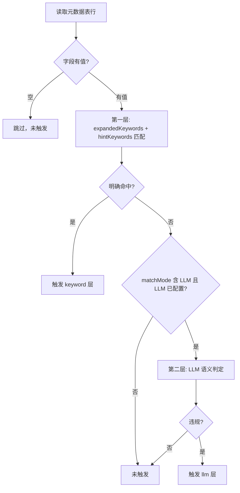

# 预警规则语义合规与组合规则设计

**日期：** 2026-06-10  
**状态：** 已确认

## 背景

现有预警规则仅支持基于 QLExpress 的指标表达式（如 `profit < 500`），无法覆盖文本字段的语义合规场景，例如：

> 备注中不得包含烟酒相关内容，包括茅台、五粮液等品牌，以及无法穷举的变体、谐音、暗示性表述。

同时，业务上常见「数值条件 **且** 文本语义」的组合需求：

> `profit < 500` **并且** `remark` 中不能包含烟、酒相关内容。

检测对象以**元数据表文本列**为佳，避免在指标/规则层重复配置关联关系。

## 目标

1. 新增 **语义合规** 规则类型，对元数据表文本列做混合判定（词库 + LLM）。
2. 新增 **组合规则** 类型，在同一规则内 AND/OR 组合指标表达式与语义检测。
3. LLM 连接信息在**管理界面**配置，不入 `application.yml`，不纳入配置包导出。
4. 保持现有 `METRIC` 规则完全兼容，无需数据迁移。

## 非目标（本期）

- 跨粒度组合（部门级聚合指标 + 订单行级 remark 的关联）—— 留 P2。
- 预警任务调度、通知下发。
- 配置包导出 LLM API Key。

---

## 规则类型

| 类型 | 代码 | 说明 |
|------|------|------|
| 指标表达式 | `METRIC` | 现有行为，不变 |
| 语义合规 | `SEMANTIC` | 仅检测元数据表文本列 |
| 组合规则 | `COMPOSITE` | 指标表达式 + 语义检测，支持 AND/OR |

### 触发逻辑

- `METRIC`：`expression` 对指标上下文求值为 `true` → 触发。
- `SEMANTIC`：目标字段文本违反 `semanticConfig.policy` → 触发。
- `COMPOSITE`：按 `triggerLogic`（`AND` / `OR`）合并两类子条件结果。

示例（COMPOSITE + AND）：

```
触发 = (profit < 500) AND (remark 语义违规)
```

---

## 数据模型

### ATELIER_WARNING_RULE 新增列

```sql
ALTER TABLE ATELIER_WARNING_RULE ADD COLUMN IF NOT EXISTS RULE_TYPE VARCHAR(20) DEFAULT 'METRIC';
ALTER TABLE ATELIER_WARNING_RULE ADD COLUMN IF NOT EXISTS RULE_CONFIG CLOB;
```

- `RULE_TYPE`：`METRIC` | `SEMANTIC` | `COMPOSITE`，默认 `METRIC`。
- `RULE_CONFIG`：JSON，语义/组合规则的扩展配置；`METRIC` 可为空。
- 现有列 `METRIC_CODES`、`EXPRESSION` 保留；`SEMANTIC` 可为空，`COMPOSITE` 两者均使用。

### ATELIER_APP_SETTING（应用级配置）

```sql
CREATE TABLE IF NOT EXISTS ATELIER_APP_SETTING (
    SETTING_KEY   VARCHAR(100) PRIMARY KEY,
    SETTING_VALUE CLOB,
    MODIFY_TIME   TIMESTAMP
);
```

Key：`semantic.llm`，Value 为 LLM 配置 JSON（见 §LLM 界面配置）。

### 领域对象

#### WarningRuleType（枚举）

`METRIC`, `SEMANTIC`, `COMPOSITE`

#### SemanticRuleConfig

```json
{
  "metaTableId": "tbl-orders",
  "fieldCode": "remark",
  "policy": "备注中不得包含烟酒相关内容…",
  "hintKeywords": ["烟", "酒", "茅台", "五粮液"],
  "matchMode": "HYBRID",
  "expandedKeywords": ["飞天", "剑南春", "…"]
}
```

| 字段 | 必填 | 说明 |
|------|------|------|
| metaTableId | 是 | 元数据表 ID |
| fieldCode | 是 | 文本字段 code（VARCHAR/CLOB/TEXT） |
| policy | 是 | 自然语言合规策略 |
| hintKeywords | 否 | 用户示例词，不穷举 |
| matchMode | 是 | `KEYWORD` / `LLM` / `HYBRID`，默认 `HYBRID` |
| expandedKeywords | 否 | 保存时 LLM 扩展词库，可手动刷新 |

#### CompositeRuleConfig

```json
{
  "triggerLogic": "AND",
  "semantic": { /* SemanticRuleConfig */ }
}
```

- `metricCodes` + `expression` 存于 WarningRule 顶层字段（与 METRIC 一致）。
- `semantic` 存于 `ruleConfig.semantic`。

#### SemanticLlmConfig（界面配置，非规则字段）

```json
{
  "enabled": true,
  "provider": "openai",
  "apiKey": "sk-…",
  "model": "gpt-4o-mini",
  "baseUrl": "https://api.openai.com/v1",
  "timeoutSeconds": 30
}
```

---

## 混合语义判定



### 保存规则时

1. 校验 `metaTableId`、`fieldCode` 存在且为文本类型。
2. 若 `matchMode` 含词库且 LLM 已配置：调用 `expand-keywords` 生成 `expandedKeywords`。
3. 可选：对样例文本试跑，返回预览结果。

### 预览结果扩展字段

| 字段 | 说明 |
|------|------|
| `_triggered` | 是否触发（与现有一致） |
| `_matchReason` | 命中原因，如「关键词：五粮液」或「语义：涉及白酒品牌」 |
| `_matchLayer` | `keyword` / `llm` / `metric` / `composite` |
| `_metricTriggered` | COMPOSITE 时指标子条件结果 |
| `_semanticTriggered` | COMPOSITE 时语义子条件结果 |

---

## 预览数据流

### METRIC（不变）

指标查询 → 每行代入 `expression` → `_triggered`。

### SEMANTIC

`MetadataService.previewTableData(metaTableId)` → 每行对 `fieldCode` 做混合语义判定。

### COMPOSITE（同行粒度 P1）

以语义配置的 `metaTableId` 为主数据源拉取行数据，同时构建指标表达式上下文：

1. 查询元数据表行（可带筛选条件）。
2. 对每行：
   - 从行内列取指标变量值（`metricCodes` 对应列须出现在同行或可由同行字段算出）。
   - 对 `fieldCode` 做语义判定。
   - `triggerLogic=AND`：两者均满足才 `_triggered=true`。
3. 若指标为聚合定义、无法从单行取值，预览返回明确错误提示，引导用户调整指标粒度或等待 P2 跨粒度关联。

**演示场景（orders 表）：** 增加 `remark` 列；`profit` 可用 `amount - cost_amount` 同行计算，或在指标定义为行级 code。

---

## LLM 界面配置

### 入口

1. 顶部栏「语义检测设置」（与导出/导入配置并列）。
2. 预警规则页创建语义/组合规则时，未配置 LLM 的提示链至该入口。

### 表单字段

| 字段 | 说明 |
|------|------|
| 启用 LLM | 开关 |
| 服务商 | `openai` / `dashscope` / `custom` |
| API Key | 密码框，留空保持不变 |
| 模型 | 文本 |
| API 地址 | 自定义 Base URL |
| 超时（秒） | 默认 30 |

### API

| 方法 | 路径 | 说明 |
|------|------|------|
| GET | `/api/v2/settings/semantic-llm` | 读取配置，`apiKey` 脱敏，返回 `apiKeyConfigured` |
| PUT | `/api/v2/settings/semantic-llm` | 保存；`apiKey` 空则保留原值 |
| POST | `/api/v2/settings/semantic-llm/test` | 测试连通性 |

### 运行时

- `enabled=false` 或 Key 未配置：`HYBRID` 退化为纯词库，界面提示「LLM 未启用」。
- 词库扩展、样例试跑同样依赖该配置。

### 安全

- API Key 存库，接口不回显明文。
- 配置包导出/导入**排除** `semantic.llm`。

---

## 预警规则 API 变更

| 方法 | 路径 | 说明 |
|------|------|------|
| POST | `/api/v2/warning/rules` | 接受 `ruleType`、`ruleConfig` |
| POST | `/api/v2/warning/rules/validate-expression` | 仅 METRIC / COMPOSITE 的指标部分 |
| POST | `/api/v2/warning/rules/validate-semantic` | 校验语义配置 + 可选样例文本 |
| POST | `/api/v2/warning/rules/expand-keywords` | 预览/生成扩展词库 |
| POST | `/api/v2/warning/rules/{id}/preview` | 按 `ruleType` 分支 |

### WarningRule 响应扩展示例

```json
{
  "id": "rule-1",
  "code": "low_profit_bad_remark",
  "name": "低利润且备注违规",
  "ruleType": "COMPOSITE",
  "metricCodes": ["profit"],
  "expression": "profit < 500",
  "ruleConfig": {
    "triggerLogic": "AND",
    "semantic": {
      "metaTableId": "tbl-orders",
      "fieldCode": "remark",
      "policy": "备注中不得包含烟酒相关内容…",
      "hintKeywords": ["烟", "酒"],
      "matchMode": "HYBRID"
    }
  },
  "enabled": true,
  "warningLevel": 2
}
```

---

## 后端模块结构

```
atelier-domain/
  warning/WarningRuleType.java
  warning/SemanticRuleConfig.java
  warning/CompositeRuleConfig.java
  warning/SemanticMatchResult.java
  settings/SemanticLlmConfig.java

atelier-warning/
  evaluator/KeywordSemanticMatcher.java
  evaluator/LlmSemanticMatcher.java
  evaluator/HybridSemanticMatcher.java
  evaluator/SemanticMatcher.java          (SPI)
  service/SemanticRuleEvaluator.java
  service/WarningRulePreviewService.java  (按类型分支)
  service/KeywordExpansionService.java

atelier-api/
  SettingsController.java
  WarningRuleController.java              (扩展)
  service/AppSettingService.java

atelier-infra/
  entity/AppSettingEntity.java
  jpa/AppSettingJpaRepository.java
```

### LLM 调用

- 使用 Java 11+ `HttpClient` 调用 OpenAI 兼容 Chat Completions API，无额外 SDK 依赖。
- Prompt 模板固定，注入 `policy` 与 `text`，要求返回 JSON：`{triggered, reason, concepts}`。
- 词库扩展 Prompt：注入 `policy` + `hintKeywords`，返回 `{keywords: [...]}`。

---

## 前端变更

### 新增组件

| 组件 | 职责 |
|------|------|
| `SemanticLlmSettingsModal` | LLM 界面配置 |
| `SemanticRuleConfigForm` | 元数据表/字段/策略/示例词/判定方式 |
| `WarningRuleTypeSelector` | METRIC / SEMANTIC / COMPOSITE 切换 |

### WarningRulePage

- 规则类型切换后条件展示对应表单项。
- `COMPOSITE` 同时展示指标表达式 + 语义配置 + `triggerLogic`。
- 列表「表达式」列：`[组合] profit < 500 且 remark·烟酒合规`。
- 预览弹窗展示 `_matchReason`、子条件结果列。

### AdminLayout

- 顶部增加「语义检测设置」按钮。

---

## 配置导出/导入

- `WarningRule` 导出包含 `ruleType`、`ruleConfig`（含 `expandedKeywords`）。
- 不导出 `semantic.llm` 应用设置。
- 导入后可选「重新扩展词库」（需目标环境已配置 LLM）。

---

## 实施阶段

| 阶段 | 范围 |
|------|------|
| **P1** | 数据模型、`METRIC` 兼容、`SEMANTIC` 词库匹配、元数据表预览、`COMPOSITE` 同行粒度、设置表与 API、前端表单骨架 |
| **P2** | LLM 接入、混合判定、词库扩展、测试连接、设置弹窗 |
| **P3** | 跨粒度指标关联、批量预览优化、演示种子数据（orders.remark） |

---

## 测试要点

1. 旧 `METRIC` 规则无迁移仍可保存/预览。
2. `SEMANTIC`：「茅台」命中词库；「宴请酒水」LLM 命中（P2）。
3. `COMPOSITE` AND：`profit < 500` 且 remark 含「烟」→ 仅同时满足行触发。
4. LLM 未配置时 `HYBRID` 降级词库，界面有提示。
5. 配置包往返 `ruleType`/`ruleConfig` 正确，不含 API Key。

---

## 示例：低利润 + 备注烟酒

| 配置项 | 值 |
|--------|-----|
| ruleType | `COMPOSITE` |
| triggerLogic | `AND` |
| expression | `profit < 500` |
| metaTableId | orders |
| fieldCode | remark |
| policy | 备注中不得包含烟酒相关内容… |
| matchMode | `HYBRID` |

| profit | remark | 指标 | 语义 | 触发 |
|--------|--------|------|------|------|
| 300 | 采购茅台 | ✓ | ✓ | ✓ |
| 300 | 正常办公 | ✓ | ✗ | ✗ |
| 800 | 采购茅台 | ✗ | ✓ | ✗ |
