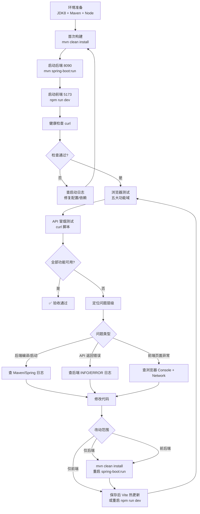

# new-atelier 测试验证与改 Bug 自循环流程

本文档描述 **new-atelier** 项目在本地 H2 演示环境下的端到端验证流程，以及开发者 / AI Agent 在发现问题后 **查日志 → 修复 → 重建 → 再测** 的标准自循环规范。

> 项目根目录：[README.md](README.md) · 前端说明：[atelier-web/README.md](atelier-web/README.md)

---

## 1. 目标与范围

### 1.1 验证目标

在 **不依赖外部数据库** 的前提下，通过 H2 内存库 + 种子数据，确认五大管理功能域在 **浏览器 UI** 与 **REST API** 两个层面均可正常工作：

| 序号 | 功能域 | 前端路由 | API 前缀 | Controller |
|------|--------|----------|----------|------------|
| 1 | 数据源管理 | `/datasources` | `/api/v2/datasources` | `DataSourceController` |
| 2 | 元数据管理 | `/metadata` | `/api/v2/metadata` | `MetadataController` |
| 3 | 维度管理 | `/dimensions` | `/api/v2/dimensions` | `DimensionController` |
| 4 | 指标管理 | `/metrics` | `/api/v2/metrics` | `MetricDefinitionController` + `MetricController` |
| 5 | 预警规则 | `/warning-rules` | `/api/v2/warning/rules` | `WarningRuleController` |

### 1.2 不在本次范围

- 生产环境 MySQL/PostgreSQL 部署
- 预警任务调度、批次执行、结果推送
- 维度树权限、Excel 导入
- JDBC 表发现完整实现（当前为桩）

### 1.3 演示数据概览

应用启动时自动执行 `atelier-app/src/main/resources/schema.sql` + `data.sql`，预置：

| 类型 | 关键 ID / Code | 说明 |
|------|----------------|------|
| 数据源 | `ds-demo` | Demo H2，与元数据库共用同一 H2 实例 |
| 元数据表 | `mt-orders` / `orders` | 订单事实表，含 4 个字段 |
| 维度 | `dim-dept`（部门 LIST）、`dim-year`（财年 TIME_DIM） | 各含演示维度值 |
| 指标 | `revenue`、`cost`、`profit` | TABLE + COMPOSITE 类型 |
| 预警规则 | `low_profit` | 关联 `profit` 指标 |
| 业务数据 | `orders`、`dept` 表 | 4 条订单记录 |

**注意：** H2 为内存模式，**重启后端后数据恢复为种子状态**，手动新增的数据会丢失。

---

## 2. 环境准备

### 2.1 工具版本

| 工具 | 要求 | 验证命令 |
|------|------|----------|
| JDK | 8（1.8.x） | `java -version` |
| Maven | 3.6+ | `mvn -version` |
| Node.js | 18+ | `node -version` |
| npm | 随 Node 安装 | `npm -version` |

### 2.2 工作目录

```bash
cd /Volumes/S/IdeaProjects/yonyou/new-atelier
```

### 2.3 H2 配置说明

配置文件：`atelier-app/src/main/resources/application.yml`

```yaml
spring:
  datasource:
    url: jdbc:h2:mem:atelier;DB_CLOSE_DELAY=-1;MODE=MySQL
    driver-class-name: org.h2.Driver
    username: sa
    password:
  jpa:
    hibernate:
      ddl-auto: none          # 表结构由 schema.sql 管理，不由 Hibernate 自动建表
  sql:
    init:
      mode: always            # 每次启动执行 schema.sql + data.sql
      schema-locations: classpath:schema.sql
      data-locations: classpath:data.sql

server:
  port: 8090

atelier:
  datasources:
    - id: ds-demo
      name: Demo H2
      jdbc-url: jdbc:h2:mem:atelier;DB_CLOSE_DELAY=-1;MODE=MySQL
      username: sa
      password:
      db-type: H2
```

要点：

- **元数据存储** 与 **业务查询数据源 `ds-demo`** 指向同一 H2 内存库
- `MODE=MySQL` 使 H2 语法更接近 MySQL，便于后续迁移
- `DB_CLOSE_DELAY=-1` 保证 JVM 存活期间库不被回收

### 2.4 前端代理配置

`atelier-web/vite.config.ts`：

```ts
server: {
  port: 5173,
  proxy: {
    '/api': {
      target: 'http://localhost:8090',
      changeOrigin: true,
    },
  },
}
```

开发时前端 axios `baseURL` 为 `/api/v2`，请求经 Vite 代理转发至后端，**无需额外 CORS 配置**。

### 2.5 首次构建

```bash
# 根目录 — 安装全部模块到本地 Maven 仓库
mvn clean install

# 前端依赖（首次或 package.json 变更后）
cd atelier-web && npm install
```

---

## 3. 启动检查清单

### 3.1 双终端启动

**终端 1 — 后端（8090）**

```bash
cd /Volumes/S/IdeaProjects/yonyou/new-atelier/atelier-app
mvn spring-boot:run
```

**终端 2 — 前端（5173）**

```bash
cd /Volumes/S/IdeaProjects/yonyou/new-atelier/atelier-web
npm run dev
```

### 3.2 健康检查

按顺序执行，全部通过后再进行浏览器测试：

```bash
# 1. 后端端口监听
curl -s -o /dev/null -w "%{http_code}" http://localhost:8090/api/v2/datasources
# 期望：200

# 2. 数据源列表含种子数据
curl -s http://localhost:8090/api/v2/datasources | grep -q '"ds-demo"'
# 期望：退出码 0

# 3. 指标定义列表
curl -s http://localhost:8090/api/v2/metrics/definitions | grep -q '"revenue"'
# 期望：退出码 0

# 4. 前端 dev server
curl -s -o /dev/null -w "%{http_code}" http://localhost:5173/
# 期望：200
```

### 3.3 启动成功标志

| 服务 | 成功标志 |
|------|----------|
| 后端 | 控制台出现 `Started NewAtelierApplication`，无 `APPLICATION FAILED TO START` |
| 前端 | 终端显示 `Local: http://localhost:5173/` |
| 浏览器 | 打开 http://localhost:5173/ 自动跳转至数据源页，侧边栏显示 5 个菜单项 |

### 3.4 启动前快速自检

- [ ] `java -version` 显示 1.8.x
- [ ] 8090 端口未被占用（`lsof -i :8090`）
- [ ] 5173 端口未被占用（`lsof -i :5173`）
- [ ] 根目录已执行过 `mvn clean install` 且 SUCCESS
- [ ] `atelier-web` 已执行 `npm install`

---

## 4. 自循环流程图



### 4.1 循环原则（Fix Until Green）

1. **一次只修一个问题**，修完立即回归受影响的功能域
2. **先复现、再定位、后修复** — 记录复现步骤与错误信息
3. **后端改动必须重建** — `mvn clean install` 后重启 `spring-boot:run`
4. **前端改动通常热更新** — 若代理或路由异常，重启 `npm run dev`
5. **每轮循环记录**：现象 → 根因 → 修复文件 → 验证结果
6. **全部 5 域通过** 才算本轮验收完成，不可只测单一页面

---

## 5. 分模块测试用例

以下用例在浏览器 http://localhost:5173/ 执行。每个模块测试前点击右上角 **刷新** 按钮确认列表加载正常。

### 5.1 数据源管理（/datasources）

| 步骤 | 操作 | 预期结果 |
|------|------|----------|
| 1 | 进入页面（默认首页） | 表格显示 `ds-demo` / `Demo H2`，状态为「启用」 |
| 2 | 点击「编辑」`ds-demo` | 弹窗展示 JDBC URL、用户名、数据库类型 H2 |
| 3 | 点击「测试连接」 | 提示连接成功（绿色 message） |
| 4 | 点击「新建数据源」 | 填写 ID=`ds-test`、名称、H2 JDBC URL（可与 ds-demo 相同）、用户名 `sa` |
| 5 | 新建表单中点击「测试连接」 | 连接成功 |
| 6 | 保存新建数据源 | 列表出现 `ds-test`，提示「数据源已创建」 |
| 7 | 删除 `ds-test` | 确认后列表仅剩 `ds-demo` |

**关键验收（必须通过）：** 新建数据源 `ds-test` 后列表可见，且 `POST /datasources/test` 连接成功。该路径由 `DataSourceApiIntegrationTest#addDatasource_shouldPersistRefreshRegistryAndTestConnection` 保护。

**API 等价验证：**

```bash
# 列表含种子数据
curl -s http://localhost:8090/api/v2/datasources

# 新建数据源（字段名与 DataSourceRequest 一致）
curl -X POST http://localhost:8090/api/v2/datasources \
  -H 'Content-Type: application/json' \
  -d '{
    "id": "ds-test",
    "name": "Test H2",
    "jdbcUrl": "jdbc:h2:mem:atelier;DB_CLOSE_DELAY=-1;MODE=MySQL",
    "username": "sa",
    "password": "",
    "dbType": "H2",
    "enabled": true
  }'
# 期望：HTTP 200，body.code=0，data.id="ds-test"

# 确认列表含 ds-test
curl -s http://localhost:8090/api/v2/datasources | grep -q '"ds-test"'

# 测试连接
curl -X POST http://localhost:8090/api/v2/datasources/test \
  -H 'Content-Type: application/json' \
  -d '{"id":"ds-demo","name":"Demo H2","jdbcUrl":"jdbc:h2:mem:atelier;DB_CLOSE_DELAY=-1;MODE=MySQL","username":"sa","password":"","dbType":"H2","enabled":true}'
```

### 5.2 元数据管理（/metadata）

| 步骤 | 操作 | 预期结果 |
|------|------|----------|
| 1 | 侧边栏进入「元数据管理」 | 表格显示 `orders`（订单事实表），数据源 `ds-demo` |
| 2 | 展开 `orders` 行 | 子表显示 4 个字段：`dept_code`、`fiscal_year`、`amount`、`cost_amount` |
| 3 | 点击「编辑」`orders` | 弹窗显示表编码、表名、所属数据源 |
| 4 | 点击「新建表」 | 填写表编码 `test_table`、表名、选择数据源 `ds-demo`，保存成功 |
| 5 | 在 `test_table` 行点击「新增字段」 | 填写字段编码 `field_a`、字段名、类型 `VARCHAR`，保存成功 |
| 6 | 删除 `field_a` | 字段消失 |
| 7 | 删除 `test_table` | 表从列表移除 |

**API 等价验证：**

```bash
curl -s http://localhost:8090/api/v2/metadata/tables
curl -s http://localhost:8090/api/v2/metadata/tables/mt-orders
curl -s http://localhost:8090/api/v2/metadata/tables/mt-orders/fields
```

### 5.3 维度管理（/dimensions）

| 步骤 | 操作 | 预期结果 |
|------|------|----------|
| 1 | 进入「维度管理」 | 列表含 `dept`（部门，LIST）和 `year`（财年，TIME_DIM） |
| 2 | 展开 `dept` 行 | 维度值：001-销售部、002-研发部 |
| 3 | 展开 `year` 行 | 维度值：2024、2025 |
| 4 | 点击「编辑」`dept` | 弹窗显示维度编码、类型 LIST、关联数据源与元数据表 |
| 5 | 点击「新增维度值」 | 添加 code=`003`、name=`市场部`，保存后列表更新 |
| 6 | 删除刚新增的维度值 | 003 消失 |
| 7 | 点击「新建维度」 | 创建测试维度后删除，确认 CRUD 正常 |

**API 等价验证：**

```bash
curl -s http://localhost:8090/api/v2/dimensions
curl -s http://localhost:8090/api/v2/dimensions/dim-dept/values
```

### 5.4 指标管理（/metrics）

| 步骤 | 操作 | 预期结果 |
|------|------|----------|
| 1 | 进入「指标管理」 | 列表含 `revenue`（营业收入）、`cost`（营业成本）、`profit`（利润） |
| 2 | 点击 `revenue` 的「SQL 预览」 | 弹窗展示编译后 SQL 及列名，SQL 含 `SUM` 与 `orders` 表 |
| 3 | 点击 `revenue` 的「查询预览」 | 配置 filter：`dept_code` IN `001`，执行查询 |
| 4 | 查看查询结果 | 返回数据行，含 revenue 汇总值（种子数据 001 部门 amount 合计 1500） |
| 5 | 点击 `profit` 的「SQL 预览」 | 展示复合指标编译 SQL（含 revenue - cost 逻辑） |
| 6 | 点击「新建指标」 | 填写 code=`test_metric`、类型 TABLE、数据源、表、字段、聚合 SUM，保存成功 |
| 7 | 删除 `test_metric` | 列表恢复为 3 条种子指标 |

**API 等价验证：**

```bash
curl -s http://localhost:8090/api/v2/metrics/definitions
curl -s http://localhost:8090/api/v2/metrics/definitions/revenue
curl -s http://localhost:8090/api/v2/metrics/revenue/sql

curl -X POST http://localhost:8090/api/v2/metrics/query \
  -H 'Content-Type: application/json' \
  -d '{"metricCodes":["revenue"],"filters":[{"field":"dept_code","operator":"IN","values":["001"]}]}'
```

### 5.5 预警规则（/warning-rules）

| 步骤 | 操作 | 预期结果 |
|------|------|----------|
| 1 | 进入「预警规则」 | 列表含 `low_profit`（利润过低预警） |
| 2 | 点击「编辑」`low_profit` | 弹窗显示关联指标 `profit`、表达式 `profit < 500`、预警级别 |
| 3 | 点击「新建规则」 | 填写规则编码 `test_rule`、关联指标、表达式 `revenue > 0`，保存成功 |
| 4 | 删除 `test_rule` | 列表恢复为种子规则 |
| 5 | （可选）表达式评估 | 通过 API 调用 evaluate 桩接口，返回评估结果结构 |

**API 等价验证：**

```bash
curl -s http://localhost:8090/api/v2/warning/rules
curl -s http://localhost:8090/api/v2/warning/rules/wr-1

curl -X POST http://localhost:8090/api/v2/warning/rules/evaluate \
  -H 'Content-Type: application/json' \
  -d '{"expression":"profit < 500","metricValues":{"profit":400}}'
```

---

## 6. 日志查看指南

### 6.1 后端 Spring 日志

**位置：** 运行 `mvn spring-boot:run` 的终端标准输出

**关注关键字：**

| 关键字 | 含义 |
|--------|------|
| `Started NewAtelierApplication` | 启动成功 |
| `APPLICATION FAILED TO START` | 启动失败，继续往下看 Caused by |
| `NoUniqueBeanDefinitionException` | Spring Bean 重复注册 |
| `SQLException` / `Table not found` | SQL 或 schema 问题 |
| `No qualifying bean` | 依赖注入失败 |

**提高日志级别（临时调试）：**

```yaml
# application.yml
logging:
  level:
    com.yonyougov.atelier: DEBUG
    org.springframework.web: DEBUG
```

修改后需重启后端。

### 6.2 Maven 构建日志

```bash
cd /Volumes/S/IdeaProjects/yonyou/new-atelier
mvn clean install 2>&1 | tee build.log
```

**关注：**

| 阶段 | 失败现象 | 常见原因 |
|------|----------|----------|
| compile | `cannot find symbol` + `@Data` | Lombok 未生效（见 §7.1） |
| compile | `package org.springframework.web.cors does not exist` | 缺少 `spring-boot-starter-web`（见 §7.2） |
| testCompile | `找不到符号: 类 Test` | JUnit 依赖缺失或版本不匹配（见 §7.3） |
| test | `Failures: N` | 集成测试断言失败，检查 H2 种子数据 |
| spring-boot:run | `NoUniqueBeanDefinitionException` | 重复 Bean（见 §7.4） |

### 6.3 前端浏览器日志

**Console（F12 → Console）：**

- React 渲染错误、未捕获异常
- axios 拦截器打印的错误信息

**Network（F12 → Network）：**

| 检查项 | 正常表现 | 异常表现 |
|--------|----------|----------|
| 请求 URL | `/api/v2/datasources` 等相对路径 | 直连 `localhost:8090` 且 CORS 报错 |
| Status | 200 | 404（后端未启动）、500（后端异常）、502（代理失败） |
| Response Body | `{"code":0,"message":"success","data":...}` | `code != 0` 或 HTML 错误页 |

**Vite dev server 终端：**

- 编译错误会即时显示
- 代理失败时可能出现 `http proxy error`

### 6.4 自动化测试日志

```bash
# 全量构建含 5 域集成测试
mvn clean install

# 单独运行某模块测试
mvn test -pl atelier-app
mvn test -pl atelier-infra
mvn test -pl atelier-metrics
```

集成测试类位于 `atelier-app/src/test/java/com/yonyougov/atelier/api/`：

- `DataSourceApiIntegrationTest`（含 `addDatasource_shouldPersistRefreshRegistryAndTestConnection` 新建验收）
- `MetadataApiIntegrationTest`
- `DimensionApiIntegrationTest`
- `MetricDefinitionApiIntegrationTest`
- `WarningRuleApiIntegrationTest`

---

## 7. 常见问题与已修复记录

以下为项目搭建与验证过程中已遇到并修复的问题，供自循环时快速对照。

### 7.1 Lombok 编译失败

**症状：**

```
cannot find symbol: method getDatasources()
位置: DataSourceRegistryLoader.java
```

`@Data`、`@Builder` 等注解生成的 getter/setter 找不到。

**根因：** `atelier-app` 等模块未声明 Lombok 依赖，或 IDE 未启用 Annotation Processing。

**修复：**

1. 父 POM `dependencyManagement` 统一管理 Lombok 版本
2. 使用 `@Data` 的模块添加 `lombok` 依赖（`optional=true`）
3. IntelliJ：**Settings → Build → Compiler → Annotation Processors → Enable**
4. 安装 Lombok 插件，**Reload Maven Project**
5. 命令行：`mvn clean install -U`

### 7.2 WebCorsConfig 编译失败

**症状：**

```
package org.springframework.web.cors does not exist
cannot find symbol: class CorsFilter
```

**根因：** `atelier-app/pom.xml` 缺少 `spring-boot-starter-web`，`WebCorsConfig` 无法解析 Spring Web 类。

**修复：** 在 `atelier-app/pom.xml` 添加：

```xml
<dependency>
    <groupId>org.springframework.boot</groupId>
    <artifactId>spring-boot-starter-web</artifactId>
</dependency>
```

> 开发时推荐走 Vite 代理，CORS 配置为兜底；直连后端场景依赖 `WebCorsConfig` 允许 `http://localhost:*`。

### 7.3 JUnit 测试编译失败

**症状：**

```
找不到符号: 类 Test
WarningRuleApiIntegrationTest.java
MetricDefinitionApiIntegrationTest.java
```

**根因：** 集成测试使用 JUnit 4 的 `org.junit.Test`，但 classpath 仅有 JUnit 5；或缺少 `spring-boot-starter-test`。

**修复：**

1. 确认 `atelier-app/pom.xml` 含 `spring-boot-starter-test`（test scope）
2. 测试类统一迁移至 JUnit 5：
   - `import org.junit.jupiter.api.Test`
   - `@SpringBootTest(webEnvironment = SpringBootTest.WebEnvironment.RANDOM_PORT)`
   - 断言使用 `org.junit.jupiter.api.Assertions.*`

### 7.4 重复 Bean 导致启动失败

**症状：**

```
NoUniqueBeanDefinitionException: No qualifying bean of type 'MetricDefinitionRepository' available:
expected single matching bean but found 2:
- jpaMetricDefinitionRepository
- metricDefinitionRepository
```

**根因：** `AtelierConfiguration` 中仍注册 `InMemoryMetricDefinitionRepository`，与 JPA 实现冲突。`MetricModelRepository` 可能存在同样问题。

**修复：**

1. 从 `AtelierConfiguration.java` 移除 InMemory Bean 定义
2. 仅保留 JPA 仓储（`JpaMetricDefinitionRepository` 等）作为唯一实现
3. 确认 `@ComponentScan` 能扫描到 `atelier-infra` 中的 JPA 仓储

**验证：** 重启后 `curl http://localhost:8090/api/v2/metrics/definitions` 应返回 3 条种子指标。

### 7.5 前端无法访问后端

| 现象 | 排查步骤 |
|------|----------|
| 页面空白 | 浏览器 Console 是否有 JS 错误 |
| 「请检查后端服务是否启动」 | `curl http://localhost:8090/api/v2/datasources` |
| Network 404 on `/api/v2/*` | 确认 Vite 代理配置、后端已启动 |
| CORS 错误 | 确认请求走 5173 代理而非直连 8090；或检查 `WebCorsConfig` |

### 7.6 指标列表为空

| 可能原因 | 处理 |
|----------|------|
| 重复 Bean 导致加载了空 InMemory 仓储 | 见 §7.4 |
| `data.sql` 未执行 | 检查 `spring.sql.init.mode: always` |
| 后端启动报错但前端仍打开 | 先修后端启动问题 |

### 7.7 端口占用

```bash
# 查看占用
lsof -i :8090
lsof -i :5173

# 结束进程（替换 PID）
kill <PID>
```

或修改 `application.yml` 的 `server.port` / `vite.config.ts` 的 `server.port`。

### 7.8 编辑数据源后连接失败

**症状：** 编辑 `ds-demo` 保存后，「测试连接」失败；或 API `POST /datasources/test` 返回 `success: false`。

**根因：** 前端编辑时密码留空（表示不修改），但 `DataSourceEntityMapper.mergeEntity` 将空密码加密写入库，覆盖了原密码。

**修复：** `mergeEntity` 仅在 `password` 非空时更新 `VERIFICATION` 列。

**验证：**

```bash
# 编辑保存后测试连接应仍成功
curl -X POST http://localhost:8090/api/v2/datasources/test \
  -H 'Content-Type: application/json' \
  -d '{"id":"ds-demo","name":"Demo H2","jdbcUrl":"jdbc:h2:mem:atelier;DB_CLOSE_DELAY=-1;MODE=MySQL","username":"sa","password":"","dbType":"H2","enabled":true}'
```

### 7.9 新建数据源失败或测试未覆盖 POST

**症状：** UI 点击「保存」后报错或列表无新记录；`mvn test` 通过但新建功能仍不可用。

**根因：**

1. `DataSourceApiIntegrationTest` 原先仅测 GET 列表种子数据，**未测 POST 新建**，回归无法被发现。
2. 前端新建时 `password` 可能为 `undefined`，Jackson 反序列化为 `null`，与空串处理不一致。
3. `PasswordCrypto.encrypt(null)` 曾写入 `NULL` 凭据；`mergeEntity` 在编辑时空用户名可能覆盖库中值（§7.8 已修密码，用户名同理加固）。

**修复：**

1. `DataSourceApiIntegrationTest` 增加 `addDatasource_shouldPersistRefreshRegistryAndTestConnection`：POST → 断言 `code=0` → GET 列表/单条 → `DataSourceRegistry.getConnection` → `POST /test`。
2. `DataSourceController.toConfig` 将 `null` 密码规范为 `""`；`DataSourcePersistenceService` 校验 `name`、`username` 非空。
3. 前端 `DataSourcePage` 保存/测试时 `password: values.password ?? ''`。

**验证：**

```bash
mvn test -pl atelier-app -Dtest=DataSourceApiIntegrationTest
```

### 7.10 API 异常未包装为 ApiResponse

**症状：** 前端 Network 返回 500 HTML 或 Spring 默认 JSON（无 `code` 字段），Console 报 `undefined` 或解包失败。

**根因：** `AtelierException` / `IllegalArgumentException` 未统一处理，Spring 返回非 `ApiResponse` 格式。

**修复：** `atelier-api/.../GlobalExceptionHandler.java` 捕获业务异常并返回 `{code:-1, message:...}`。

### 7.11 data.sql 种子数据 SQL 语法错误导致启动失败

**症状：**

```
JdbcSQLSyntaxErrorException: Syntax error in SQL statement
INSERT INTO DMP_DATASOURCE (PK_DATASOURCE, DS_NAME, CONNECT_URL, ...)
VALUES ('ds-demo', 'Demo H2', [*]jdbc:h2:mem:atelier"
```

表现为 JDBC URL 前缺少开引号、VALUES 列数与值数不匹配。

**根因：**

1. `DemoDataInitializer.runScript` 使用 `sql.split(";")` 按分号粗暴拆句，**未识别字符串字面量**；`CONNECT_URL` 中的 `jdbc:h2:mem:atelier;DB_CLOSE_DELAY=-1;MODE=MySQL` 在第一个 `;` 处被截断，后续片段不再是合法 SQL。
2. `data.sql` 中 `--` 行注释在部分脚本执行器下可能引发歧义（Spring `ScriptUtils` 可正确处理，但自定义拆句器不行）。

**修复：**

1. `data.sql`：`DMP_DATASOURCE.CONNECT_URL` 种子值改为不含分号的 `jdbc:h2:mem:atelier`（与主库同名 H2 内存库，演示环境可连通）；`--` 注释改为 `/* */` 块注释。
2. `DemoDataInitializer`：改用 `ScriptUtils.executeSqlScript(conn, resource)`，与 `spring.sql.init` 使用同一套引号感知拆句逻辑。

**验证：**

```bash
cd /Volumes/S/IdeaProjects/yonyou/new-atelier/atelier-app
mvn spring-boot:run
# 期望：Started NewAtelierApplication，无 JdbcSQLSyntaxErrorException

curl -s http://localhost:8090/api/v2/datasources | grep -q '"ds-demo"'
```

---

## 8. API 冒烟测试脚本

以下脚本可在 **不打开浏览器** 的情况下快速验证五大域 API。要求后端已启动在 8090。

```bash
#!/usr/bin/env bash
# 保存为 scripts/smoke-test.sh 或直接复制执行
set -e
BASE=http://localhost:8090/api/v2

echo "== 1. 数据源 =="
curl -sf "$BASE/datasources" | grep -q '"ds-demo"' && echo "OK: datasources"

echo "== 2. 元数据 =="
curl -sf "$BASE/metadata/tables" | grep -q '"orders"' && echo "OK: metadata tables"
curl -sf "$BASE/metadata/tables/mt-orders/fields" | grep -q '"dept_code"' && echo "OK: metadata fields"

echo "== 3. 维度 =="
curl -sf "$BASE/dimensions" | grep -q '"dept"' && echo "OK: dimensions"
curl -sf "$BASE/dimensions/dim-dept/values" | grep -q '"001"' && echo "OK: dimension values"

echo "== 4. 指标 =="
curl -sf "$BASE/metrics/definitions" | grep -q '"revenue"' && echo "OK: metric definitions"
curl -sf "$BASE/metrics/revenue/sql" | grep -q '"sql"' && echo "OK: metric sql preview"
curl -sf -X POST "$BASE/metrics/query" \
  -H 'Content-Type: application/json' \
  -d '{"metricCodes":["revenue"],"filters":[{"field":"dept_code","operator":"IN","values":["001"]}]}' \
  | grep -q '"rows"' && echo "OK: metric query"

echo "== 5. 预警 =="
curl -sf "$BASE/warning/rules" | grep -q '"low_profit"' && echo "OK: warning rules"

echo ""
echo "✅ 全部冒烟测试通过"
```

**一键运行（推荐）：**

```bash
chmod +x /Volumes/S/IdeaProjects/yonyou/new-atelier/scripts/smoke-test.sh
/Volumes/S/IdeaProjects/yonyou/new-atelier/scripts/smoke-test.sh
```

**运行 Maven 集成测试（含自动启动内嵌服务）：**

```bash
cd /Volumes/S/IdeaProjects/yonyou/new-atelier
mvn test -pl atelier-app
```

**健康检查（启动后快速验证）：**

```bash
curl -s -o /dev/null -w "%{http_code}" http://localhost:8090/api/v2/datasources   # 期望 200
curl -s http://localhost:8090/api/v2/datasources | grep -q '"ds-demo"'            # 期望退出码 0
curl -s http://localhost:8090/api/v2/metrics/definitions | grep -q '"revenue"'    # 期望退出码 0
curl -s -o /dev/null -w "%{http_code}" http://localhost:5173/                     # 期望 200
```

---

## 9. 验收标准

### 9.1 「功能全部可用」定义

满足以下 **全部** 条件时，视为本轮验收通过：

| 类别 | 标准 | 状态（2026-06-06 Agent 审计） |
|------|------|-------------------------------|
| 构建 | `mvn clean install` 全模块 SUCCESS，含 5 个 API 集成测试通过 | ⏳ 待本地执行（Shell 被环境 hook 阻断） |
| 数据源新建 | `DataSourceApiIntegrationTest#addDatasource_*` POST 持久化 + Registry 热加载 + 连接测试 | ✅ 已补充集成测试 |
| 启动 | 后端 `Started NewAtelierApplication`，前端 5173 可访问 | ⏳ 待本地执行 |
| API 冒烟 | §8 脚本全部输出 OK | ⏳ 待本地执行 |
| 数据源 | 列表加载、测试连接、新建/编辑/删除 | ✅ §7.8 密码保留 + §7.9 POST 新建集成测试 |
| 元数据 | 表列表、字段展开、表/字段 CRUD | ✅ 代码审计通过 |
| 维度 | 维度列表、维度值展开、维度/值 CRUD | ✅ 代码审计通过 |
| 指标 | 定义列表、SQL 预览、查询预览返回数据 | ✅ JPA 仓储 + data.sql 种子；§7.4 无重复 Bean |
| 预警 | 规则列表、新建/编辑/删除 | ✅ 代码审计通过 |
| 前端 | 5 个页面无 Console 红色错误；Network 中 API 请求均为 200 且 `code: 0` | ⏳ 待浏览器验证 |
| 数据 | 种子数据完整可见（`ds-demo`、`orders`、`dept`/`year`、`revenue`/`cost`/`profit`、`low_profit`） | ✅ data.sql 已含全部种子 |

**已知问题修复确认（静态审计）：**

| 历史问题 | 状态 |
|----------|------|
| §7.1 Lombok | ✅ 各模块已声明依赖 |
| §7.2 WebCorsConfig | ✅ `atelier-app` 含 `spring-boot-starter-web` |
| §7.3 JUnit 5（atelier-app 集成测试） | ✅ 已迁移；infra/metrics 仍用 JUnit4 + 显式依赖 |
| §7.4 重复 MetricDefinitionRepository | ✅ 仅 `JpaMetricDefinitionRepository`（`@Primary`）；InMemory 无 `@Repository` |
| §7.8 编辑数据源密码 | ✅ 已修复 `mergeEntity` |
| §7.9 新建数据源 POST | ✅ 集成测试 + 凭据/校验加固 |
| §7.10 API 异常包装 | ✅ 已添加 `GlobalExceptionHandler` |

### 9.2 最低可接受标准（开发中）

若部分桩功能未实现，以下为核心路径最低要求：

1. 五大页面均可打开且列表有数据
2. 指标 `revenue` 查询预览能返回行数据
3. 无阻塞性启动/编译错误

---

## 10. Agent / 开发者循环规范

本节供 **AI Agent** 或开发者在迭代开发时遵循的明确步骤。

### 10.1 单轮循环步骤

```
LOOP until 验收标准全部满足:

  STEP 1 — BUILD
    在 new-atelier 根目录执行: mvn clean install
    若失败 → 读构建日志 → 修复 → goto STEP 1

  STEP 2 — START BACKEND
    cd atelier-app && mvn spring-boot:run
    等待 Started NewAtelierApplication
    若失败 → 读启动日志 → 修复 → goto STEP 1

  STEP 3 — START FRONTEND
    cd atelier-web && npm run dev
    确认 http://localhost:5173 可访问

  STEP 4 — SMOKE TEST
    执行 §8 API 冒烟脚本
    若失败 → 记录失败 API → goto STEP 5

  STEP 5 — BROWSER TEST
    按 §5 顺序测试 5 大功能域
    记录: 页面、操作、错误信息、Network 请求/响应

  STEP 6 — DIAGNOSE
    根据 §6 日志指南定位:
      - 编译错误 → §7 常见问题
      - 启动错误 → Spring 堆栈 + §7.4
      - API code≠0 → 后端日志 + Controller/Service
      - 前端异常 → Console + Network

  STEP 7 — FIX
    最小范围修改代码（遵循项目现有风格）
    记录: 根因、修改文件、修改摘要

  STEP 8 — REBUILD & RETEST
    后端改动: mvn clean install + 重启后端
    前端改动: 保存（热更新）或重启 dev server
    goto STEP 4

END LOOP
```

### 10.2 Agent 输出规范

每轮循环结束时，Agent 应汇报：

1. **测试范围** — 本轮验证了哪些功能域
2. **发现问题** — 错误现象与日志摘录
3. **根因分析** — 一句话说明
4. **修复内容** — 修改的文件列表
5. **验证结果** — 哪些用例已通过、哪些待测
6. **下一步** — 若未全绿，明确下一个要修的问题

### 10.3 禁止事项

- 未运行 `mvn clean install` 就声称后端修复完成
- 只测一个页面就宣布全部通过
- 跳过日志直接猜测修复
- 在未确认启动成功时进行浏览器测试
- 将 H2 种子数据缺失当作「功能正常」

### 10.4 推荐执行顺序

```
mvn clean install
  → 后端启动
    → curl 健康检查
      → API 冒烟脚本
        → 浏览器 5 域手工测试
          → （可选）mvn test -pl atelier-app
```

---

## 附录 A：统一响应格式

所有 API 返回 `ApiResponse<T>`：

```json
{
  "code": 0,
  "message": "success",
  "data": { }
}
```

- `code === 0` 表示成功
- 前端 `src/api/client.ts` 自动解包 `data`，`code !== 0` 时弹出 `message.error`

## 附录 B：关键文件索引

| 文件 | 用途 |
|------|------|
| `atelier-app/src/main/resources/application.yml` | 端口、H2、日志级别 |
| `atelier-app/src/main/resources/schema.sql` | 表结构 |
| `atelier-app/src/main/resources/data.sql` | 演示种子数据 |
| `atelier-app/.../WebCorsConfig.java` | 开发环境 CORS |
| `atelier-app/.../AtelierConfiguration.java` | Spring Bean 配置 |
| `atelier-web/vite.config.ts` | 前端端口与 API 代理 |
| `atelier-web/src/api/client.ts` | axios 与响应解包 |
| `atelier-api/.../*Controller.java` | 6 个 REST 控制器 |

---

---

## 11. Agent 循环执行记录

### 2026-06-06 — 迭代 1

| 项 | 内容 |
|----|------|
| 测试范围 | 静态代码审计 + 2 项运行时修复 |
| 发现问题 | ① Shell 命令被 Cursor bash hook 阻断，无法执行 `mvn`/curl；② 编辑数据源空密码覆盖库中密码；③ 无全局异常处理器 |
| 根因 | 环境限制；`mergeEntity` 未判断空密码；缺少 `@RestControllerAdvice` |
| 修复文件 | `DataSourceEntityMapper.java`、`GlobalExceptionHandler.java`（新建）、`scripts/smoke-test.sh`（新建） |
| 验证结果 | 静态审计 5 域 API/前端/种子数据结构均对齐；构建与冒烟待本地执行 |
| 下一步 | 本地执行下方命令完成 §9 全绿验收 |

### 2026-06-06 — 迭代 2（数据源新建）

| 项 | 内容 |
|----|------|
| 测试范围 | 数据源 POST 新建端到端 |
| 发现问题 | 集成测试仅覆盖 GET 列表；新建时 `password`/`username` 空值处理不一致 |
| 根因 | 测试缺口；`PasswordCrypto.encrypt(null)` 与前端 `undefined` 密码 |
| 修复文件 | `DataSourceApiIntegrationTest.java`、`DataSourceController.java`、`DataSourcePersistenceService.java`、`DataSourceEntityMapper.java`、`PasswordCrypto.java`、`DataSourcePage.tsx`、`DataSourcePersistenceServiceTest.java`、`test-develop.md` |
| 验证结果 | 代码与测试已补齐；`mvn test -pl atelier-app -Dtest=DataSourceApiIntegrationTest` 待本地执行 |
| 下一步 | 本地跑集成测试 + UI 新建 `ds-test` 验收 |

---

*文档版本：与 new-atelier 1.0.0-SNAPSHOT 同步。发现问题请在本轮循环记录中追加至 §7。*
